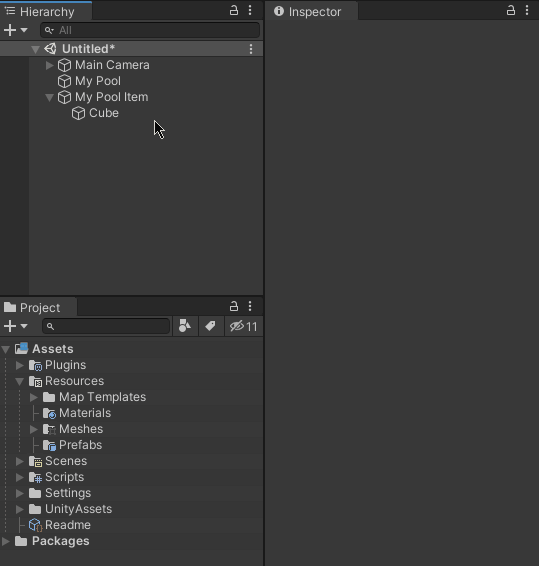

# Useful Unity Codes


In this repository, I will add some of the code that I usually use in any Unity project.
Feel free to use them or give your suggestion on how to make them better!

# Codes Inside:

## Singleton
Ensures that MonoBehaviour has only one instance in the scene, and provides global (statistical) access to it.

### Setup
  - Inherit your MonoBehaviour class from the SingletonMonobehaviour<T> class.
  - You can also override the Awake() method if necessary.
  - Access your singleton globally through Example.Instance

### Usage

```sh
public class MySingleton : SingletonMonobehaviour<MySingleton>
{
    override protected void Awake ()
    {
        base.Awake ();
        //Your awake starts here...
    }
}

public class Example : MonoBehaviour
{
    private void Start ()
    {
        MySingleton.Instance.DoSomething();
    }
}
```

## Pool Pattern
Manages a collection of objects, so that they are available for use and reuse by the application, avoiding the constant need to instantiate or destroy objects at run time.



### Setup
  - Add the Pool component to an empty gameObject.
  - Add the PoolItem component to the desired gameObject that will be used by the Pool, or, inherit your MonoBehaviour from PoolItemMonoBehaviour.
  - Turn your gameObject into a Prefab, and reference it in the Pool.

### You can also
  - Use the PoolItem component's onSpawn and onDespawn events to do things at the moment the Pool activates the item in the scene or removes it, respectively.
  - Or override the OnSpawn and OnDespawn methods if your component is inheriting from PoolItemMonobehaviour, for the same effect.

### Usage
```sh
public class MyPoolItem : PoolItemMonobehaviour
{
    public override void OnSpawn ()
    {
        //Do stuff here on spawned!
    }
    
    public override void OnDespawn ()
    {
        //Do stuff here on despawned!
    }
    
    public void Explode (float delay)
    {
        StartCoroutine (ExplodeAfterDelay(delay))
    }
    
    private IEnumerator ExplodeAfterDelay (float delay)
    {
        yield return new WaitForSeconds (delay);
        
        //Method of the PoolItemMonobehaviour class that automatically calls
        //the pool to remove the object from the scene.
        Despawn();
    }
}

public class Example : MonoBehaviour
{
    public Pool myExamplePool;
    
    private void Start ()
    {
        var myPoolItem = myExamplePool.GetPoolItem(transform.position, transform.rotation);
        myPoolItem.Explode (2f);
    }
}
```
